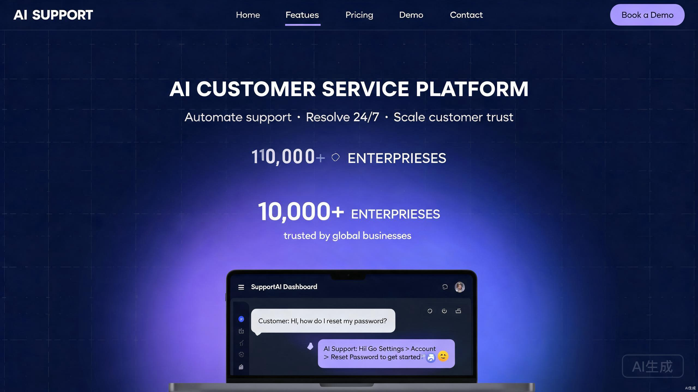

# AI Native Website Architect Skill

A powerful AI Skill that generates complete, production-ready, multilingual corporate websites from a single natural language description.

## ✨ Key Features

- **🎯 One-Sentence Website Generation**: Describe your needs, get a full React + TypeScript + TailwindCSS project
- **🏭 Multi-Industry Support**: Technology, Medical, Ecommerce, and Cross-Border DTC industries
- **🌍 Multilingual**: Built-in i18n with Chinese, English, Japanese, and Korean
- **🎨 Dual Theme System**: Light and dark mode with smooth transitions
- **💎 Motion Design**: Integrated Framer Motion for professional-grade interactions
- **🧠 Anti-AI Aesthetic**: Built-in rules to avoid generic AI-generated visual patterns
- **📱 Responsive**: Mobile-first design, perfectly adapted to all screen sizes
- **🔌 AI Chatbot Integration**: Optional intelligent customer service component

## 🚀 Quick Start

### 1. Install the Skill

#### Option A: Manual Installation

```bash
# Clone the repository
git clone https://github.com/wushal/ai-smart-website-builder.git

# Copy the skill directory to your TRAE skills folder
cp -r ai-smart-website-builder ~/.trae-cn/skills/
```

#### Option B: Reference in Conversation

Reference the `SKILL.md` file path directly in a TRAE conversation:

```
@/path/to/ai-smart-website-builder/SKILL.md
```

### 2. Usage Examples

Once the Skill is activated in TRAE, simply describe your needs in natural language:

```
Generate an AI customer service SaaS landing page
```

```
I need a premium dental clinic website with an appointment booking feature
```

```
Build an organic skincare ecommerce site with a clean, minimalist style
```

```
Create a cross-border DTC brand site focused on eco-friendly lifestyle
```

## 🎯 Anti-AI Aesthetic Design Philosophy

The core differentiator of this Skill is its **refusal to produce generic AI-generated designs**. We've built a comprehensive anti-AI detection mechanism:

### ❌ Common AI Patterns We Avoid

- **Visual Homogenization**: No more purple-blue gradients on every website
- **Overused AI Colors**: No `#8B5CF6`, `#06B6D4`, `#667eea` or other "AI defaults"
- **Animation Overload**: Not every element gets the same `fadeInUp` animation
- **Formulaic Layouts**: No rigid "centered Hero + 3-column Features" template
- **Empty Buzzwords**: No "empower", "revolutionize", "intelligent" fluff

### ✅ Industry-Specific Differentiation

| Industry | Visual Language | Motion Style | Color Palette |
|----------|----------------|-------------|---------------|
| **Technology** | Dark, futuristic, linear | Restrained, tech-feel | Dark bg + accent brand color |
| **Medical** | Bright, professional, clean | Gentle, trustworthy | White/light blue + medical tones |
| **Ecommerce** | Vibrant, high-impact, urgency | Dynamic, conversion-driven | Brand color + high contrast |
| **Cross-Border** | Lifestyle, brand storytelling | Smooth, narrative | Soft tones + global feel |

## 📸 Examples

Each industry produces a distinctly different visual style, showcasing true design differentiation:

### Technology — AI Customer Service SaaS



### Medical — Dental Clinic


### Ecommerce — Organic Skincare Store


### Cross-Border — DTC Lifestyle Brand


---

## 🏭 Supported Industries

| Industry | Characteristics | Best For |
|----------|-----------------|----------|
| **Technology** | Dark themes, futuristic, data-driven | SaaS products, AI tools, B2B services |
| **Medical** | Bright, professional, trustworthy | Clinics, hospitals, medical devices |
| **Ecommerce** | High conversion, visual impact, urgency | Retail, beauty, fashion |
| **Cross-Border** | Brand storytelling, lifestyle, global | DTC brands, international trade |

## 📁 Project Structure

```
ai-smart-website-builder/
├── SKILL.md                      # Core Skill entry file
├── skill-meta.yaml               # Skill metadata
├── README.md                     # Project documentation
│
├── config/                       # Configuration files
│   ├── industry-map.yaml         # Industry mapping
│   ├── tech-stack.yaml           # Tech stack config
│   └── generation-rule.yaml      # Generation rules
│
├── design-system/                # Design system
│   ├── color-system/             # Color system
│   ├── typography/               # Typography rules
│   ├── motion-system/            # Motion design rules
│   ├── layout-system/            # Layout system
│   ├── industries/               # Industry-specific designs
│   │   ├── technology/
│   │   ├── medical/
│   │   ├── ecommerce/
│   │   └── cross-border/
│   └── quality-check/            # Quality detection rules
│       ├── ai-style-check.md     # AI style detection
│       └── ui-quality-check.md   # UI quality checks
│
├── generators/                   # Generators
│   ├── analyze-request.md        # Request analysis
│   ├── select-template.md        # Template selection
│   ├── select-component.md       # Component selection
│   └── generate-code.md          # Code generation
│
├── prompts/                      # Prompt templates
│   ├── copywriting.md            # Copywriting generation
│   ├── image-generation.md       # Image generation
│   ├── ui-generation.md          # UI generation
│   └── website-analysis.md       # Website analysis
│
├── templates/                    # Industry templates
│   ├── technology-template/
│   ├── medical-template/
│   ├── ecommerce-template/
│   └── cross-border-template/
│
├── themes/                       # Industry themes
│   ├── technology.ts
│   ├── medical.ts
│   ├── ecommerce.ts
│   └── cross-border.ts
│
├── examples/                     # Examples
│   ├── technology-example.md
│   ├── medical-example.md
│   ├── ecommerce-example.md
│   └── cross-border-example.md
│
├── references/                   # Design references
│   ├── technology.md
│   ├── medical.md
│   ├── ecommerce.md
│   └── cross-border.md
│
└── react-starter/                # React project template
    ├── src/
    ├── components/
    ├── sections/
    ├── pages/
    ├── services/
    ├── styles/
    └── README.md
```

## 🛠️ Generated Tech Stack

- **Framework**: React 18 + TypeScript
- **Build**: Vite
- **Styling**: TailwindCSS
- **Animation**: Framer Motion
- **Icons**: Lucide React
- **State Management**: Zustand
- **i18n**: react-i18next
- **Routing**: React Router

## 📖 Documentation

- [Core SKILL Rules](SKILL.md)
- [React Starter Template](react-starter/README.md)
- [Design System Overview](design-system/README.md)
- [Anti-AI Style Detection Rules](design-system/quality-check/ai-style-check.md)

## 🤝 Contributing

Contributions are welcome! Please read [CONTRIBUTING.md](CONTRIBUTING.md) for details.

## 📄 License

This project is open-sourced under the [MIT License](LICENSE).

## 🙏 Acknowledgements

- Linear design system inspiration
- Framer Motion animation library
- TailwindCSS styling framework

---

**Let AI create better website experiences** 🚀
